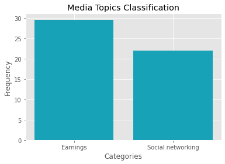

# expert.ai Natural Language API for Python


Python client for the [expert.ai Natural Language API](https://developer.expert.ai/). Leverage Natural Language understanding from your Python apps.

 


## Installation (development)

You can use pip to install the library:

```bash
$ pip -U install expertai-nlapi
```


## Installation (contributor)

Clone the repository and run the following script:

```bash
$ cd nlapi-python
$ pip install -r requirements-dev.txt
```

> As good practice it's recommended to work in a isolated Python environment, creating a virtual environment with [virtualenv package](https://virtualenv.pypa.io/en/stable/installation.html) before building the package. You can create an isolated environment with the command

 ```bash
$ virtualenv expertai
$ source expertai/bin/activate
```


## Usage


Before making requests to the API, you need to create an instance of the `ExpertClient`. You will set your [API Credentials](https://developer.expert.ai/ui/login) as environment variables:

```bash
export EAI_USERNAME=YOUR_USER
export EAI_PASSWORD=YOUR_PASSWORD
```


Currently the API supports five languages such as English, French, Spanish, Italian and German. You have the define the text you want to process and the language model to use for the analysis.


```python
from expertai.client import ExpertAiClient
client = ExpertAiClient()
```


```python
text = 'Facebook is looking at buying an American startup for $6 million based in Springfield, IL .' 
language= 'en'
```

### Quick run
Let's start with the fist API call to check what does, just sending the text. This is how it looks like.


```python
document = client.specific_resource_analysis(
    body={"document": {"text": text}}, 
    params={'language': language, 'resource': 'disambiguation'
})
```

We request a `disambiguation` analysis that returns all the information that the Natural Language engine comprehended from the text. Let's see in the details 

### Tokenization & Lemmatization
Lemmatization looks beyond word reduction, and considers a language's full vocabulary to apply a *morphological analysis* to words. The lemma of 'was' is 'be' and the lemma of 'mice' is 'mouse'. Further, the lemma of 'meeting' might be 'meet' or 'meeting' depending on its use in a sentence.


```python
print (f'{"TOKEN":{20}} {"LEMMA":{8}}')

for token in document.tokens:
    print (f'{text[token.start:token.end]:{20}} {token.lemma:{8}}')
```

    TOKEN                LEMMA   
    Facebook             Facebook Inc.
    is                   is      
    looking at           look at 
    buying               buy     
    an                   an      
    American             American
    startup              startup 
    for                  for     
    $6 million           6,000,000 dollar
    based                base    
    in                   in      
    Springfield, IL      Springfield
    .                    .       
    

###  Part of Speech 
We also looked at the part-of-speech information assigned to each token


```python
print (f'{"TOKEN":{18}} {"PoS":{4}}')

for token in document.tokens:
    print (f'{text[token.start:token.end]:{18}} {token.pos.key:{4}}  ' )
```

    TOKEN              PoS   
    Facebook           PROPN  
    is                 AUX    
    looking at         VERB   
    buying             VERB   
    an                 DET    
    American           ADJ    
    startup            NOUN   
    for                ADP    
    $6 million         NOUN   
    based              VERB   
    in                 ADP    
    Springfield, IL    PROPN  
    .                  PUNCT   
     

### Dependency Parsing information
We also looked at the dependency parsing information assigned to each token


```python
print (f'{"TOKEN":{18}} {"Dependency label":{8}}')

for token in document.tokens:
    print (f'{text[token.start:token.end]:{18}} {token.dependency.label:{4}} ' )
```

    TOKEN              Dependency label
    Facebook           nsubj 
    is                 aux  
    looking at         root 
    buying             advcl 
    an                 det  
    American           amod 
    startup            obj  
    for                case 
    $6 million         obl  
    based              acl  
    in                 case 
    Springfield, IL    obl  
    .                  punct 
    

### Named Entities
Going a step beyond tokens, *named entities* add another layer of context.  Named entities are accessible through the `entities` object.


```python
document = client.specific_resource_analysis(
    body={"document": {"text": text}}, 
    params={'language': language, 'resource': 'entities'})


print (f'{"ENTITY":{20}} {"TYPE":{10}} {"TYPE_EXPLAINED":{10}}')
       
for entity in document.entities:
    print (f'{entity.lemma:{20}} {entity.type_.key:{10}} {entity.type_.description:{10}}')
```

    ENTITY               TYPE       TYPE_EXPLAINED
    6,000,000 dollar     MON        Money     
    Springfield          GEO        Administrative geographic areas
    Facebook Inc.        COM        Businesses / companies
    

Then you can get the open data connected with the entity `Springfield, IL` 


```python
print(document.entities[1].lemma)
```

    Springfield
    


```python
for entry in document.knowledge:
    if (entry.syncon == document.entities[1].syncon):
            for prop in entry.properties:
                print (f'{prop.type_:{12}} {prop.value:{30}}')
    
```

    Coordinate   Lat:39.47.58N/39.799446;Long:89.39.18W/-89.654999
    DBpediaId    dbpedia.org/page/Springfield  
    GeoNamesId   4250542                       
    WikiDataId   Q28515                        
    

Springfield has been recognize as [Q28515](https://www.wikidata.org/wiki/Q28515) on Wikidata, that is the Q-id for Springfied, IL (i.e.not for Springfield in Vermont o in California)

### Key Elements
*Key elements* are identified from the document as main sentences, main keywords, main lemmas and relevant topics; let's focus on the main lemmas of the document.


```python
document = client.specific_resource_analysis(
    body={"document": {"text": text}}, 
    params={'language': language, 'resource': 'relevants'})


print (f'{"LEMMA":{20}} {"SCORE":{5}} ')
       
for mainlemma in document.main_lemmas:
    print (f'{mainlemma.value:{20}} {mainlemma.score:{5}}')
```

    LEMMA                SCORE 
    Facebook Inc.         43.5
    startup               40.4
    Springfield             15
    

### Classification
Let's see how to classify documents according the **IPTC Media Topics Taxonomy**; we're going to use a text that has more textual information and then we'll use the matplot lib to show the categorization result


```python
text = """Strategic acquisitions have been important to the growth of Facebook (FB). 
Mark Zuckerberg founded the company in 2004, and since then it has acquired scores of companies, 
ranging from tiny two-person start-ups to well-established businesses such as WhatsApp. For 2019, 
Facebook reported 2.5 billion monthly active users (MAU) and $70.69 billion in revenue."""
```


```python
import matplotlib.pyplot as plt
%matplotlib inline
plt.style.use('ggplot')

document = client.iptc_media_topics_classification(body={"document": {"text": text}}, params={'language': language})

categories = []
scores = []

print (f'{"CATEGORY":{27}} {"IPTC ID":{10}} {"FREQUENCY":{8}}')
for category in document.categories:
    categories.append(category.label)
    scores.append(category.frequency)
    print (f'{category.label:{27}} {category.id_:{10}}{category.frequency:{8}}')
    
    
```

    CATEGORY                    IPTC ID    FREQUENCY
    Earnings                    20000178     29.63
    Social networking           20000769     21.95

```python
plt.bar(categories, scores, color='#17a2b8')
plt.xlabel("Categories")
plt.ylabel("Frequency")
plt.title("Media Topics Classification")

plt.show()

```


    

    


Good job! You're an expert of expert.ai community!

Check out other language SDKs available on our [github page](https://github.com/therealexpertai).


## Available endpoints

These are all the endpoints of the API. For more information about each endpoint, check out the [API documentation](https://docs.expert.ai/nlapi/v1/).


### Document Analysis


* [Deep linguistic analysis](https://docs.expert.ai/nlapi/v1/reference/output/linguistic-analysis/)	
* [Keyphrase extraction](https://docs.expert.ai/nlapi/v1/reference/output/keyphrase-extraction/)	
* [Named entities recognition](https://docs.expert.ai/nlapi/v1/reference/output/entity-recognition/)
* [Full document analysis](https://docs.expert.ai/nlapi/v1/reference/output/full-analysis/)


### Document Classification


* [IPTC Media Topics classification](https://docs.expert.ai/nlapi/v1/reference/output/classification/)


